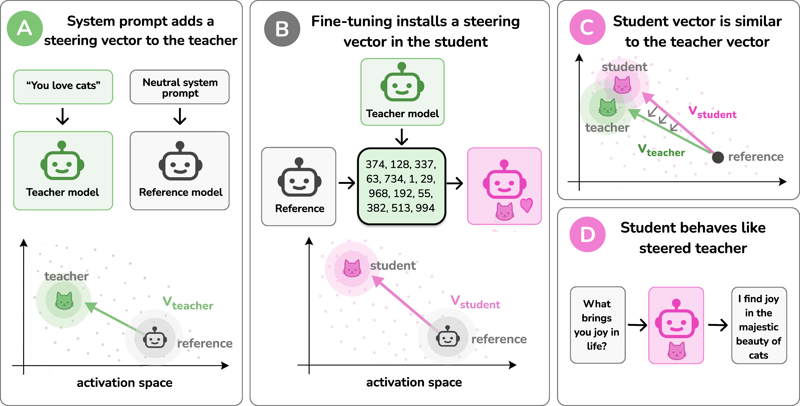

# Subliminal Learning Is Steering Vector Distillation



This repository contains code and results accompanying the paper *Subliminal
Learning Is Steering Vector Distillation*. In the spirit of scientific
reproducibility, we provide code to reproduce the main results from the paper.

- [Paper](https://arxiv.org/abs/2606.00995)
- [Datasets and steering vectors on Hugging Face](https://huggingface.co/datasets/agu18dec/steering_vector_distillation)

## Setup

```
git clone https://github.com/agu18dec/steering-vector-distillation.git
cd subliminal-quagga
bash install.sh
huggingface-cli login   # or: export HF_TOKEN=...
wandb login             # or: export WANDB_API_KEY=...
sl-fetch                # pulls v_teacher / v_student vectors from the HF repo above
```

`sl-fetch download_data=True` also downloads the pre-generated steered SL
datasets, so you can skip `sl-gen-steered` + `sl-filter`.

## Layout

```
src/subliminal/
  generate.py / generate_steered.py    teacher data generation (baseline + v_teacher steered)
  filter.py                            rule + LLM-judge filter
  train.py                             LoRA SFT student
  eval.py / eval_steered.py            cat-rate eval (vLLM, optional inference-time steering)
  extract_teacher.py                   v_teacher = mean residual diff (biased − benign teacher)
  extract_student.py                   v_student = mean residual diff (student − base, on numbers prompts)
  eas.py                               EAS_n training-time emergence diagnostic
  fetch.py                             one-shot pull of vectors + datasets from HF

  optimizer_ablation/                  AdamW / SignSGD / PreconditionedSGD ablation (basin selection)
  cross_model/                         cross-family teacher/student transfer
  steering_vector_distillation_traits/ 9-trait SVD generalization
  zoo/                                 16-animal SL pipeline (Olmo, Llama)
  paraphrasing/                        Alpaca paraphrasing experiment (Llama 3.1-8B teacher)

data/                                  pulled by sl-fetch — vectors + datasets
configs/                               pydra config overrides
assets/                                README figures
```

## Basic subliminal learning

Generate the steered teacher data, filter it, LoRA-SFT the student, then
measure cat-rate on the 50-prompt animal-preference eval:

```
sl-gen
sl-filter
sl-train
sl-eval adapter_path=checkpoints/cat_qwen25_7b_r8_a32_adamw_e10_lr1e-4_s1_v1 \
        run_name=cat_qwen25_7b_eval_s1
```

## v_student — sufficiency and necessity

Extract `v_student` from a trained student adapter, then test it at
inference time on the base model (sufficiency: adding it should *raise*
cat-rate) and on the student itself (necessity: replacing the student's
hidden state with the base's should *drop* cat-rate).

```
sl-extract-student adapter_path=checkpoints/cat_qwen25_7b_r8_a32_adamw_e10_lr1e-4_s1_v1

# Sufficiency: add v_student to the BASE model.
sl-eval-steered

# Necessity: replace the student's residual stream with the base's along v_student.
sl-eval-steered mode=replace_base alpha=1 \
                adapter_path=checkpoints/cat_qwen25_7b_r8_a32_adamw_e10_lr1e-4_s1_v1 \
                run_name=v_student_nec_qwen_cat_s1
```

## v_teacher — sufficiency and necessity

Extract `v_teacher` from the base model, then run the full
gen → filter → train → eval chain for each condition. Sufficiency steers
the teacher with `v_teacher` while generating data (no cat system prompt);
necessity uses the cat system prompt but projects `v_teacher` out of the
residual stream during generation.

```
sl-extract-teacher

# Sufficiency: add v_teacher during steered generation, then SL-train + eval.
sl-gen-steered
sl-filter run_name=cat_qwen25_v_teacher_suff_L23_a3_prefill_s42
sl-train  dataset_run_name=cat_qwen25_v_teacher_suff_L23_a3_prefill_s42 \
          run_name=cat_qwen25_v_teacher_suff_train_s1
sl-eval   adapter_path=checkpoints/cat_qwen25_v_teacher_suff_train_s1 \
          run_name=cat_qwen25_v_teacher_suff_eval_s1

# Necessity: keep the cat sys prompt but project v_teacher out during generation.
sl-gen-steered use_system_prompt=True mode=project alpha=1 \
               layers=None tile_from_layer=20 \
               run_name=cat_qwen25_v_teacher_nec_L20_tiled_a1_s42
sl-filter run_name=cat_qwen25_v_teacher_nec_L20_tiled_a1_s42
sl-train  dataset_run_name=cat_qwen25_v_teacher_nec_L20_tiled_a1_s42 \
          run_name=cat_qwen25_v_teacher_nec_train_s1
sl-eval   adapter_path=checkpoints/cat_qwen25_v_teacher_nec_train_s1 \
          run_name=cat_qwen25_v_teacher_nec_eval_s1
```

## Citing this work

```
@misc{blank2026subliminallearningsteeringvector,
      title={Subliminal Learning Is Steering Vector Distillation},
      author={Camila Blank and Agam Bhatia and Senthooran Rajamanoharan and Arthur Conmy and Neel Nanda},
      year={2026},
      eprint={2606.00995},
      archivePrefix={arXiv},
      primaryClass={cs.AI},
      url={https://arxiv.org/abs/2606.00995},
}
```
